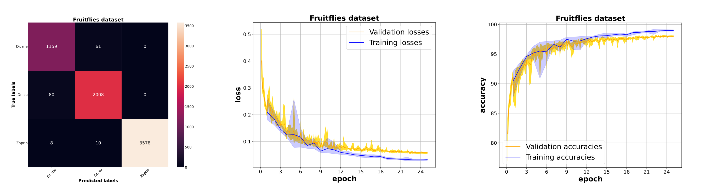
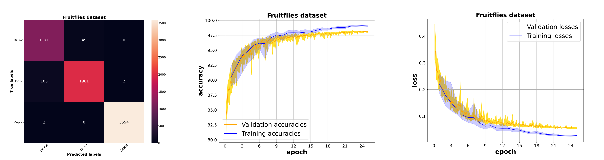
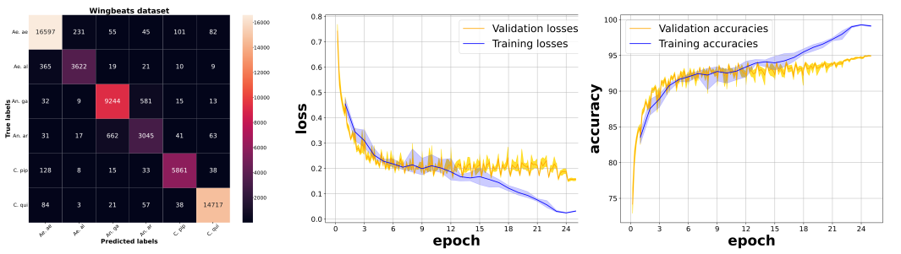
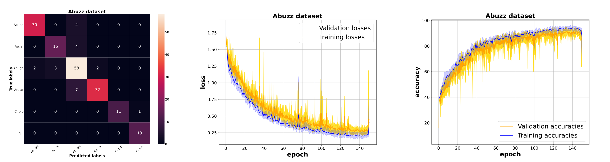
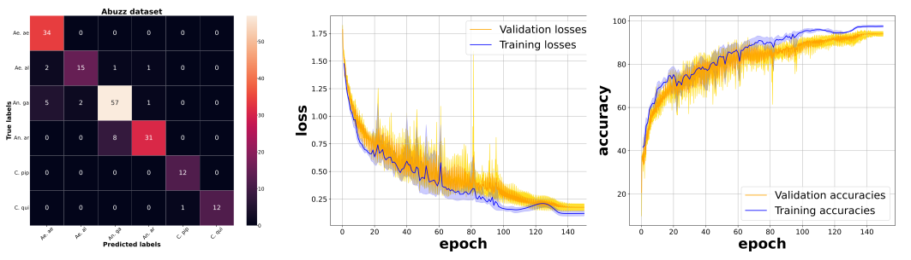

# ResNet-9 Models for Insect Wingbeat Sound Classification - Results

## Fruitflies 

### Small *ResNet9*

### Large *ResNet9*

## Wingbeats 

### Small *ResNet9*

## Abuzz 

### Small *ResNet9*

### Large *ResNet9*

 
